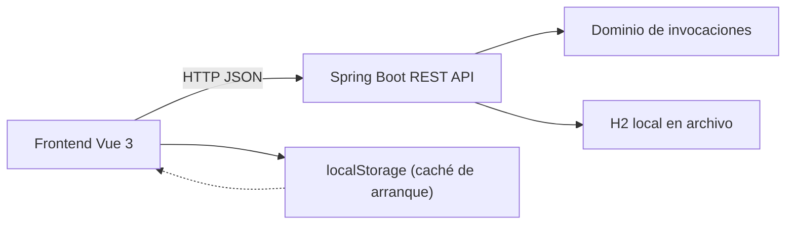
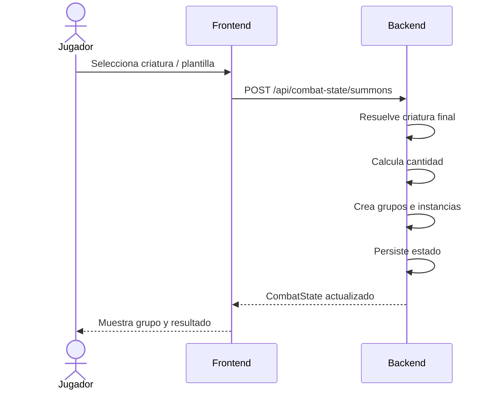

# Visión del producto

## Resumen

Kazkum Koldugum Summons es una aplicación web local para usar en mesa con un personaje de **Pathfinder 1e**: un **Inquisidor enano Neutral Bueno** con arquetipo **Monster Tactician**.

La app no pretende modelar Pathfinder completo. Su objetivo real es acelerar las operaciones repetitivas de combate:

- invocar criaturas desde catálogo JSON;
- aplicar reglas fijas del personaje;
- agrupar criaturas activas por criatura final;
- gestionar PG por instancia;
- tirar ataques y TS por grupo;
- consultar la ficha final expandida cuando haga falta.

## Estado actual del producto

El código actual expone estas pantallas:

- **Combate**: pantalla principal con grupos activos y tiradas.
- **Invocaciones**: selección de criatura, plantilla, asistente y accesos rápidos.
- **Catálogo**: búsqueda, filtros y previsualización de criatura base + criatura final.
- **Configuración**: ajuste de `maxSummonMonsterLevel` y usos diarios máximos.

## Principio de diseño

La aplicación resuelve operaciones mecánicas simples y deja al jugador las decisiones contextuales.

No automatiza:

- si un ataque impacta;
- si un crítico confirma contra la CA enemiga;
- daño a enemigos;
- RD/resistencias/inmunidades sobre el objetivo;
- estados contextuales;
- modificadores temporales;
- iniciativa;
- mapa;
- flanqueo;
- cobertura.

## Arquitectura de alto nivel

## Flujo funcional principal

## Criterio de éxito

La app es correcta si reduce el tiempo de gestión de invocaciones en mesa y evita tener que consultar constantemente el documento largo de referencia.
