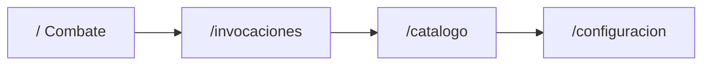
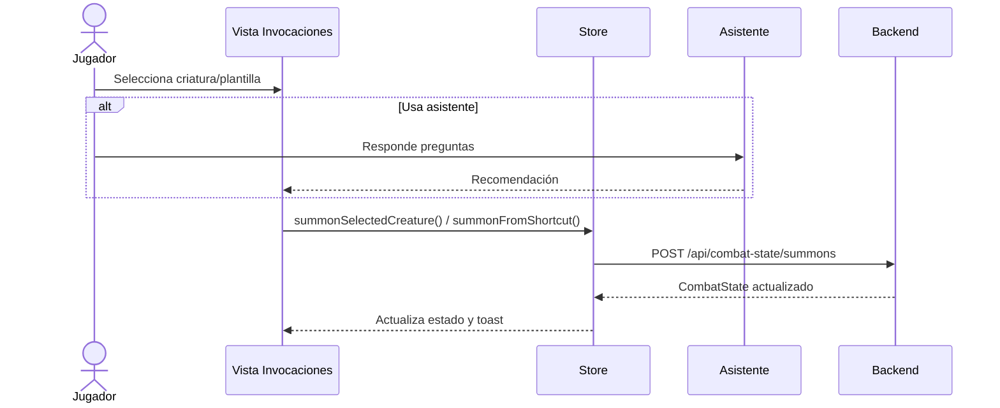

# Pantallas y navegación actual

## Navegación principal

La barra superior muestra:

- nombre de la aplicación;
- navegación principal;
- acceso a configuración;
- botón **Limpiar** para borrar invocaciones activas con confirmación.

## 1. Combate

La vista de combate es la pantalla principal para mesa.

### Controles globales

- `Atacar con todas`
- `Tirar TS con todas`

### Qué muestra

- grupos activos agrupados por criatura final;
- resumen mecánico del grupo;
- cards individuales con PG;
- estado `HEALTHY`, `DAMAGED` o `DOWN`;
- modal con el último resultado de tirada.

### Controles por grupo

- `Atacar`
- `Salvaciones`
- `Expandir ficha`

### Controles por criatura

- botones rápidos `-10`, `-5`, `-1`, `+1`, `+5`, `+10`;
- acción `Otra cantidad` para abrir el modal de daño/curación;
- `Eliminar`.

## 2. Invocaciones

La vista de invocaciones permite preparar una nueva criatura.

### Secciones

- panel de usos diarios;
- selector de nivel;
- selector de criatura;
- selector de plantilla;
- botón `Invocar`;
- botón `Asistente de invocación`;
- listas de últimas usadas y más usadas.

### Flujo actual

## 3. Catálogo

La vista de catálogo permite:

- buscar criaturas base;
- filtrar por nivel;
- filtrar por plantilla;
- ver resumen base;
- ver previsualización final resuelta.

La previsualización muestra:

- criatura base;
- criatura final;
- reglas aplicadas;
- ataques, defensas y stat block.

## 4. Configuración

La vista de configuración permite editar:

- `maxSummonMonsterLevel`;
- usos diarios máximos.

## Notas de UX

- interfaz optimizada para tablet;
- sin dependencia de hover;
- botones grandes;
- modo oscuro;
- estado persistido entre recargas.
