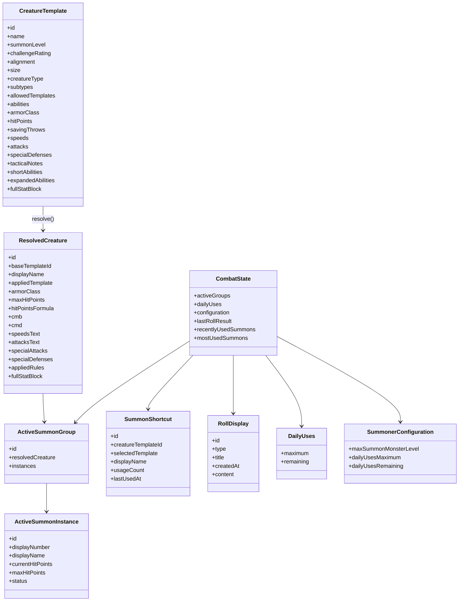

# Modelo de dominio actual

## Vista general

El dominio separa:

- ficha base de criatura;
- criatura final resuelta;
- grupos activos;
- instancias con PG independientes;
- usos diarios;
- configuración;
- tiradas;
- accesos rápidos de invocación.

## `CreatureTemplate`

Representa la ficha base cargada desde JSON.

### Contiene, entre otros

- `alignment`
- `size`
- `creatureType`
- `subtypes`
- `initiative`
- `senses`
- `perception`
- `armorClass`
- `hitPoints`
- `savingThrows`
- `speeds`
- `attacks`
- `specialAttacks`
- `specialDefenses`
- `fullStatBlock`

## `ResolvedCreature`

Es la criatura final usada por la UI y las tiradas.

### Reglas actuales aplicadas

- **Augment Summoning**: +4 STR, +4 CON.
- **Versatile Summon Monster**: plantilla opcional.
- **Deep Guardian**: +1 ataque y +1 CA cuando hay burrow o subtipo earth.

### Detalles relevantes del código actual

- `displayName` añade el nombre de la plantilla como prefijo.
- `alignment` pasa a `NG` cuando se aplica plantilla.
- `armorClass.touch` no cambia con Deep Guardian.
- `fullStatBlock` ya viene resuelto y formateado.
- `appliedRules` registra las reglas que efectivamente se aplicaron.

## `ActiveSummonGroup`

Agrupa instancias con la misma criatura final.

Si se invoca de nuevo la misma criatura resuelta, las nuevas instancias se añaden al grupo existente.

## `ActiveSummonInstance`

Cada instancia guarda:

- `currentHitPoints`
- `maxHitPoints`
- `status`
- `displayNumber`

### Estados visibles

- `HEALTHY`
- `DAMAGED`
- `DOWN`

No existe un estado visible llamado `REMOVED`; al eliminar una instancia, desaparece del grupo.

## `DailyUses`

Mantiene el límite de usos:

- `maximum >= 0`
- `0 <= remaining <= maximum`

Operaciones:

- `increase`
- `decrease`
- `reset`
- `consumeOne`
- `updateMaximum`

## `SummonerConfiguration`

Es la configuración persistida singleton.

Campos actuales:

- `maxSummonMonsterLevel`
- `dailyUsesMaximum`
- `dailyUsesRemaining`

La configuración se normaliza al arrancar y se sincroniza con el estado de combate.

## `SummonShortcut`

Representa un acceso rápido reutilizable desde **Últimas usadas** o **Más usadas**.

Campos clave:

- `creatureTemplateId`
- `selectedTemplate`
- `displayName`
- `usageCount`
- `lastUsedAt`

## `RollDisplay`

Contiene el último resultado de tirada mostrado en modales.

Tipos actuales:

- `ATTACK_GROUP`
- `SAVING_THROWS_GROUP`
- `SUMMON_QUANTITY`
- `GENERIC`

## Tiradas

El dominio produce resultados ya listos para pintar:

- `GroupAttackRollResult`
- `GroupSavingThrowsRollResult`
- `SingleAttackRollResult`
- `DamageRollResult`
- `CriticalThreatResult`
- `CreatureSavingThrowsRollResult`

Cada resultado incluye `displayText` para la UI.

## Observación importante

El código actual no delega la resolución de impacto o confirmación al motor:

- el sistema tira;
- el jugador decide en mesa;
- la UI muestra resultados legibles y separados por componente.
